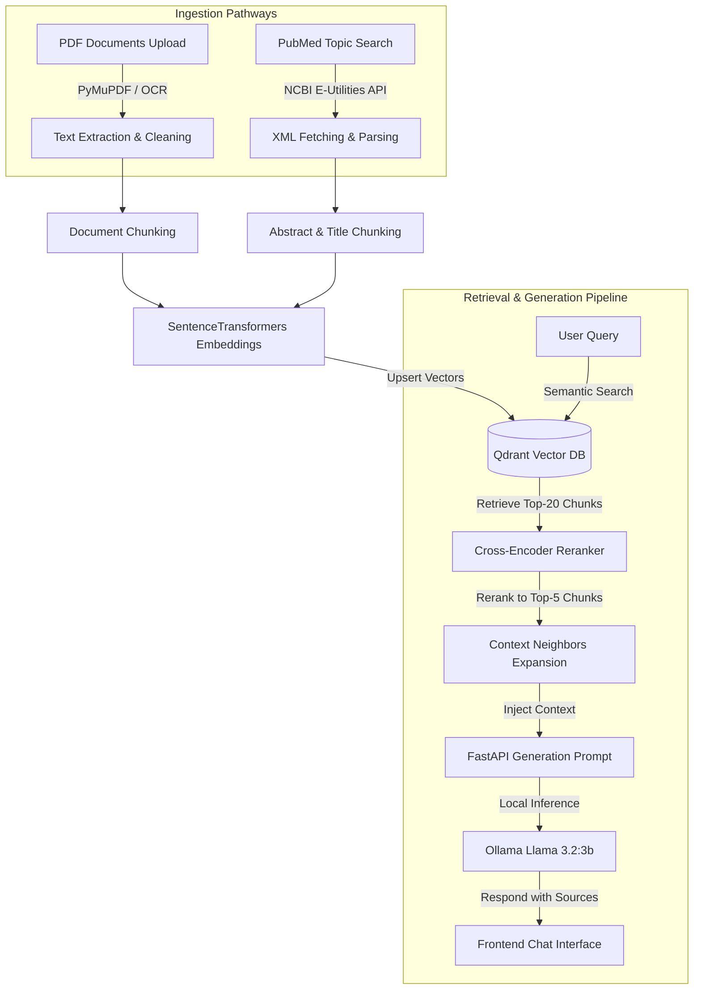

# 🧬 AI Medical Research & Document Intelligence Assistant

An advanced, production-grade retrieval-augmented generation (RAG) system built to parse, index, search, and analyze complex medical documents and PubMed scientific literature. 

The application is split into a high-performance **FastAPI backend** managing document processing, semantic database vectors, and LLM inference, and an elegant **Streamlit frontend** presenting a premium, theme-customized user interface.

---

## 🏗️ Architecture Overview

The system operates via two primary knowledge pathways, utilizing local vector databases and specialized AI pipelines to deliver highly accurate answers:



---

## 📂 Project Directory Structure

We have restructured the backend services from a flat layout into a clean, modular structure. Below is the full project tree:

```
AI-DOC-READ-SYSTEM/
├── backend/
│   ├── app/
│   │   ├── api/                    # API route definitions
│   │   ├── core/                   # Core application configurations
│   │   ├── database/               # Database initialization scripts
│   │   ├── schemas/                # Pydantic data schemas
│   │   ├── services/               # RESTURCTURED MODULAR SERVICES
│   │   │   ├── database/           # Vector Database Connection & Ops
│   │   │   │   └── qdrant_service.py
│   │   │   ├── indexing/           # Text extraction, chunking & indexing
│   │   │   │   ├── document_chunking_service.py
│   │   │   │   ├── document_indexing_service.py
│   │   │   │   ├── document_processor.py
│   │   │   │   ├── embedding_service.py
│   │   │   │   ├── ocr_service.py
│   │   │   │   ├── pdf_service.py
│   │   │   │   ├── pubmed_indexing_service.py
│   │   │   │   └── pubmed_parser_service.py
│   │   │   ├── retrieval/          # Semantic Search, Reranking & Retrieval
│   │   │   │   ├── context_expansion_service.py
│   │   │   │   ├── document_retrieval_service.py
│   │   │   │   ├── hybrid_search_service.py
│   │   │   │   ├── pubmed_retrieval_service.py
│   │   │   │   ├── pubmed_service.py
│   │   │   │   ├── reranker_service.py
│   │   │   │   ├── retrieval_pipeline_service.py
│   │   │   │   └── retrieval_service.py
│   │   │   ├── generation/         # RAG Prompting & LLM Generation
│   │   │   │   ├── chat_service.py
│   │   │   │   ├── document_chat_service.py
│   │   │   │   ├── document_rag_service.py
│   │   │   │   ├── llm_service.py
│   │   │   │   ├── pubmed_chat_service.py
│   │   │   │   └── pubmed_rag_service.py
│   │   │   └── evaluation/         # Performance benchmarking & quality tests
│   │   │       ├── evaluation_service.py
│   │   │       └── retrieval_evaluation_service.py
│   │   │   └── __init__.py
│   │   ├── config.py
│   │   └── main.py                 # FastAPI application gateway
│   ├── evaluation/                 # Retrieval & RAG evaluation datasets
│   │   ├── diabetes_test_set.json
│   │   └── retrieval_test_set.json
│   ├── uploads/                    # Directory holding uploaded PDFs
│   ├── requirements.txt            # Backend Python dependencies
│   └── venv/                       # Virtual environment
├── frontend/
│   ├── app.py                      # Streamlit frontend application
│   └── services/
│       └── api_client.py           # API wrapper for Streamlit-to-FastAPI communication
├── docker/                         # Docker configuration files
└── docker-compose.yml              # Services orchestration (Qdrant)
```

---

## 🛠️ Tech Stack & Service Components

1. **FastAPI & Uvicorn**: A highly efficient, asynchronous Python web framework used to serve the core API endpoints.
2. **Streamlit**: Renders a rich visual layout with glassmorphic styling, compact custom sidebar parameters, and modern gradient file upload inputs.
3. **Qdrant Vector Database**: An enterprise-grade vector database running in a Docker container, storing document embedding vectors for semantic search.
4. **SentenceTransformers**:
   - **Embeddings**: `BAAI/bge-small-en-v1.5` converts text chunks into dense float vectors.
   - **Reranker**: `BAAI/bge-reranker-base` cross-encoder reranks retrieved chunks based on semantic alignment.
5. **Ollama (Llama 3.2:3b)**: Hosts the local language model on localhost for secure, off-network document generation.
6. **PyMuPDF & Tesseract**: Ingests PDF sheets, extracts structural text, and runs OCR fallback for scanned figures or locked documents.

---

## 🚀 Key Pipelines End-to-End

### 1. Document RAG Pipeline
* **Ingestion**: Documents are uploaded via the frontend and routed to the backend `/upload-document` endpoint.
* **Extraction & Chunking**: `pdf_service.py` extracts text, and `document_chunking_service.py` splits text into clean semantic chunks with overlapping headers.
* **Vector Storage**: `embedding_service.py` embeds each chunk, and `qdrant_service.py` stores them under the `uploaded_document` collection.
* **Search & Reranking**: When a question is asked, `document_retrieval_service.py` searches Qdrant for the top 20 candidate chunks. `reranker_service.py` scores the candidates down to the top 5.
* **Context Expansion**: Neighbors are fetched from the database to expand the reading context around the top 5 chunks.
* **Answer Generation**: `rag_service.py` passes the query and expanded context to the local Llama model via `llm_service.py` to formulate a verified response including primary source page numbers.

### 2. PubMed Research Pipeline
* **PubMed API Query**: The user specifies a medical topic. The backend queries NCBI E-Utilities (`esearch.fcgi`) to retrieve PMIDs.
* **Details Fetching**: NCBI `efetch.fcgi` downloads raw XML records for the PMIDs.
* **XML Parsing**: `pubmed_parser_service.py` parses XML tags into paper dictionaries with titles, authors, journals, and abstract strings.
* **Vector Indexing**: Abstracts are chunked, embedded, and indexed in the Qdrant `pubmed` collection.
* **Targeted Retrieval**: Qdrant is queried to retrieve the most relevant PubMed literature abstract segments.
* **Generation**: Answers are generated with citations pointing directly back to the PubMed ID sources.

---

## ⚙️ Getting Started & Setup

### Prerequisites
- Install **Docker** & **Docker Compose**.
- Install **Ollama** and pull Llama 3.2:
  ```bash
  ollama pull llama3.2:3b
  ```

### 1. Launch Qdrant Database
Run the compose file to boot up the Qdrant container:
```bash
docker-compose up -d
```
The Qdrant dashboard will be accessible at `http://localhost:6333/dashboard`.

### 2. Setup FastAPI Backend
Navigate to the backend directory, activate the virtual environment, and install dependencies:
```bash
cd backend
python -m venv venv
source venv/bin/activate
pip install -r requirements.txt
```
Start the FastAPI server:
```bash
uvicorn app.main:app --reload --host 127.0.0.1 --port 8000
```
API Documentation will be interactive at `http://127.0.0.1:8000/docs`.

### 3. Setup Streamlit Frontend
Navigate to the frontend directory and start the Streamlit server:
```bash
cd ../frontend
streamlit run app.py --server.port 8501
```
The application UI will open in your browser at `http://localhost:8501`.

---

## 📊 Evaluation & Benchmarking Suite

The project includes built-in verification and evaluation scripts inside the scratch directory. These scripts validate imports, test RAG outputs, and measure database performance:

### 1. Retrieval Performance Evaluation
Evaluates the retrieval pipeline using `retrieval_test_set.json` and reports metrics:
```bash
# Run from backend virtualenv:
python ../.gemini/antigravity/brain/f9d2de3c-4c1d-4590-b130-76614cd0b781/scratch/run_retrieval_eval.py
```
**Reported Metrics**:
- **Hit Rate**: Probability that the expected chunk is present in the top-k retrieved chunks.
- **Average Recall**: Proportion of expected chunks successfully retrieved.
- **Average Precision**: Proportion of retrieved chunks that are relevant.
- **Mean Reciprocal Rank (MRR)**: Evaluates the rank order of the first correct chunk.

### 2. RAG End-to-End Evaluation
Validates that the generator answers match target answers using `diabetes_test_set.json`:
```bash
# Run from backend virtualenv:
python ../.gemini/antigravity/brain/f9d2de3c-4c1d-4590-b130-76614cd0b781/scratch/run_rag_eval.py
```
Checks for answer correctness, compilation errors, and verifies the import mappings are working perfectly under the new directory layout.

---

## 🔄 Reverting / Rollback Mechanism
The directory structure changes are fully committed to the `restructure-layout` branch. If you prefer the old layout, simply run:
```bash
git checkout main
```
This restores the exact flat folder layout instantly.